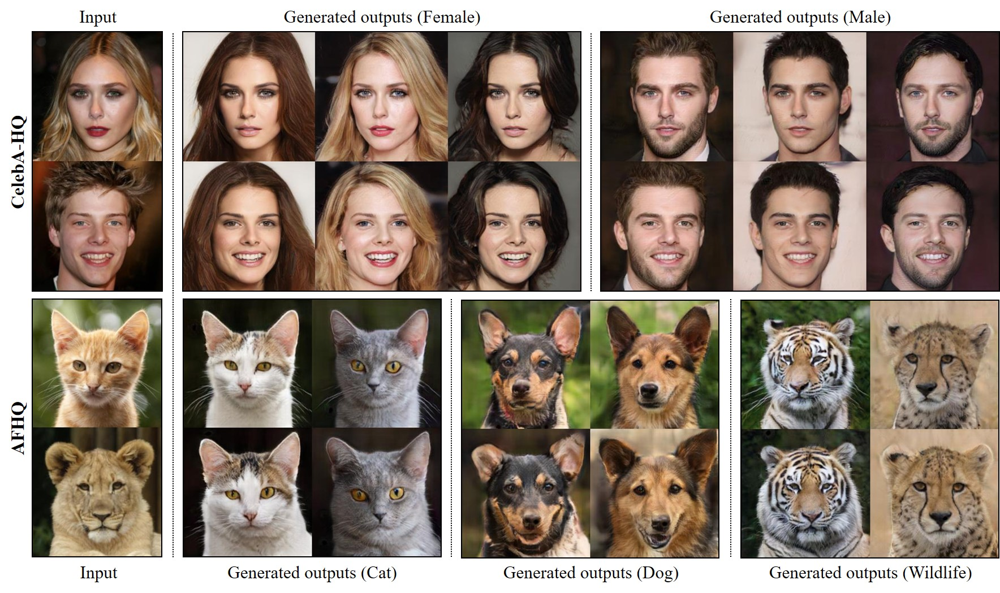
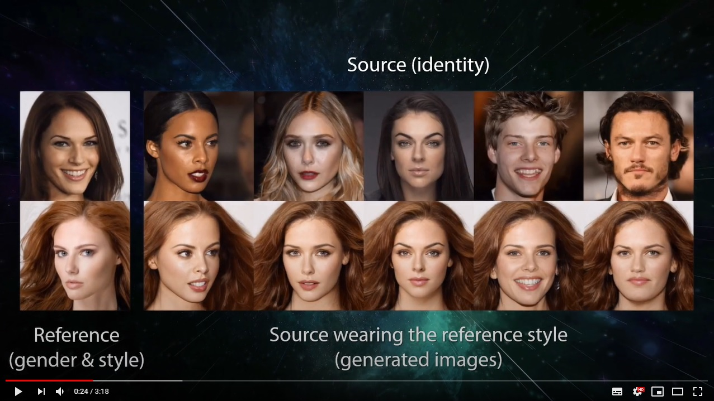
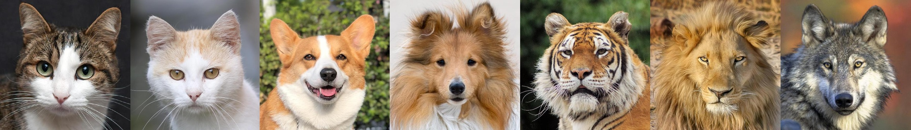

# StarGAN v2——官方Pythorch实现

<p align="left"></p>

> **StarGAN v2：多域的多样图像合成**  
> 作者：[Yunjey Choi](https://github.com/yunjey)\*, [Youngjung Uh](https://github.com/youngjung)\*, [Jaejun Yoo](http://jaejunyoo.blogspot.com/search/label/kr)\*, [Jung-Woo Ha](https://www.facebook.com/jungwoo.ha.921)  
> 收入CVPR 2020（*表示相等的贡献）  

> 论文地址：<https://arxiv.org/abs/1912.01865>  
> 视频地址：<https://youtu.be/0EVh5Ki4dIY>

> **摘要**： *一个好的图像到图像的翻译模型应该学习不同视觉域之间的映射，同时满足以下特性：1）生成图像的多样性和2）多域的可伸缩性。现有的方法解决了这两个问题中的任何一个，其多样性有限，或者所有领域都有多个模型。我们提出了starganv2，一个单一的框架，它可以同时处理这两个问题，并在基线上显示出显著改进的结果。在CelebA HQ和一个新的动物面部数据集（AFHQ）上的实验验证了我们在视觉质量、多样性和可扩展性方面的优势。为了更好地评估图像到图像的转换模型，我们发布了AFHQ，高质量的动物脸，具有较大的域间和域内变化。代码、预训练模型和数据集可在clovaai/stargan-v2上获得。*

## 预告视频

单击图以观看摘要视频。

[](https://youtu.be/0EVh5Ki4dIY)

## TensorFlow实现

我们的团队成员junho对starganv2的TensorFlow实现可以在[clovaai/stargan-v2-tensorflow](https://github.com/clovaai/stargan-v2-tensorflow)看到。

## 软件安装

克隆仓库：

```bash
git clone https://github.com/clovaai/stargan-v2.git
cd stargan-v2/
```

下载对应的依赖：

```bash
conda create -n stargan-v2 python=3.6.7
conda activate stargan-v2
conda install -y pytorch=1.4.0 torchvision=0.5.0 cudatoolkit=10.0 -c pytorch
conda install x264=='1!152.20180717' ffmpeg=4.0.2 -c conda-forge
pip install opencv-python==4.1.2.30 ffmpeg-python==0.2.0 scikit-image==0.16.2
pip install pillow==7.0.0 scipy==1.2.1 tqdm==4.43.0 munch==2.5.0
```

## 数据集与预训练网络

我们提供了一个脚本来下载StarGAN v2和相应的预训练网络中使用的数据集。数据集和网络检查点将分别下载并存储在“data”和“expr/checkpoints”目录中。

**CelebA-HQ**：为了下载[CelebA-HQ](https://drive.google.com/drive/folders/0B4qLcYyJmiz0TXY1NG02bzZVRGs) 数据集和训练过的网络，运行下面的命令：

```bash
bash download.sh celeba-hq-dataset
bash download.sh pretrained-network-celeba-hq
bash download.sh wing
```

**AFHQ**：为了下载[AFHQ](https://github.com/clovaai/stargan-v2/blob/master/README.md#animal-faces-hq-dataset-afhq) 数据集和训练过的网络，运行下面的命令：

```bash
bash download.sh afhq-dataset
bash download.sh pretrained-network-afhq
```

## 生成插值视频

下载预先训练好的网络后，您可以合成反映参考图像不同风格（如发型）的输出图像。以下命令将把生成的图像和插值视频保存到“expr/results”目录中。

**CelebA-HQ**：要生成图像和插值视频，请运行以下命令：

```bash
python main.py --mode sample --num_domains 2 --resume_iter 100000 --w_hpf 1 \
               --checkpoint_dir expr/checkpoints/celeba_hq \
               --result_dir expr/results/celeba_hq \
               --src_dir assets/representative/celeba_hq/src \
               --ref_dir assets/representative/celeba_hq/ref
```

要转换自定义图像，首先手动裁剪图像，使脸部占整体的比例与CelebA HQ相似。然后，运行以下命令进行额外的精细旋转和裁剪。“inp_dir”目录中的所有自定义图像都将对齐并存储在“out_dir”目录中。

```bash
python main.py --mode align \
               --inp_dir assets/representative/custom/female \
               --out_dir assets/representative/celeba_hq/src/female
```

<p align="left"></p>

**AFHQ**：生成图像和插值视频，请运行以下命令：

```bash
python main.py --mode sample --num_domains 3 --resume_iter 100000 --w_hpf 0 \
               --checkpoint_dir expr/checkpoints/afhq \
               --result_dir expr/results/afhq \
               --src_dir assets/representative/afhq/src \
               --ref_dir assets/representative/afhq/ref
```

<p align="left"></p>

## 评价指标

使用[Fr&eacute;chet Inception Distance (FID)](https://arxiv.org/abs/1706.08500)和[Learned Perceptual Image Patch Similarity (LPIPS)](https://arxiv.org/abs/1801.03924)来评价StarGAN V2，运行以下命令：

```bash
# celeba-hq
python main.py --mode eval --num_domains 2 --w_hpf 1 \
               --resume_iter 100000 \
               --train_img_dir data/celeba_hq/train \
               --val_img_dir data/celeba_hq/val \
               --checkpoint_dir expr/checkpoints/celeba_hq \
               --eval_dir expr/eval/celeba_hq

# afhq
python main.py --mode eval --num_domains 3 --w_hpf 0 \
               --resume_iter 100000 \
               --train_img_dir data/afhq/train \
               --val_img_dir data/afhq/val \
               --checkpoint_dir expr/checkpoints/afhq \
               --eval_dir expr/eval/afhq
```

注意，评估度量是使用随机潜在向量或参考图像来计算的，这两个向量都是由[种子数](https://github.com/clovaai/stargan-v2/blob/master/main.py#L35)选择的。在本文中，我们报告了使用不同种子数的10次测量值的平均值。下表显示了潜在引导合成和参考引导合成的计算值。

| 数据集 |  FID（隐藏）  |  LPIPS（隐藏） |  FID（参考） | LPIPS（参考）| 运行时间  |
| :---------- | :------------: | :----: | :-----: | :----: | :----------:|
| `celeba-hq` | 13.73 &pm; 0.06 | 0.4515 &pm; 0.0006  | 23.84  &pm; 0.03 | 0.3880 &pm; 0.0001 | 49min 51s
| `afhq` | 16.18 &pm; 0.15 | 0.4501 &pm; 0.0007 | 19.78 &pm; 0.01 | 0.4315 &pm; 0.0002 | 64min 49s

## 训练网络

要从头开始训练StarGAN v2，请运行以下命令。生成的图像和网络检查点将分别存储在“expr/samples”和“expr/checkpoints”目录中。在一个特斯拉V100 GPU上训练大约需要三天。请查看[这里](https://github.com/clovaai/stargan-v2/blob/master/main.py#L86-L179) 来训练参数并有一个对应的介绍。

```bash
# celeba-hq
python main.py --mode train --num_domains 2 --w_hpf 1 \
               --lambda_reg 1 --lambda_sty 1 --lambda_ds 1 --lambda_cyc 1 \
               --train_img_dir data/celeba_hq/train \
               --val_img_dir data/celeba_hq/val

# afhq
python main.py --mode train --num_domains 3 --w_hpf 0 \
               --lambda_reg 1 --lambda_sty 1 --lambda_ds 2 --lambda_cyc 1 \
               --train_img_dir data/afhq/train \
               --val_img_dir data/afhq/val
```

## 动物面孔总部数据集（AFHQ）

<p align="left"></p>

我们发布了一个新的动物面部数据集，动物面部HQ（AFHQ），由15000张512×512分辨率的高质量图像组成。上图显示了AFHQ数据集的示例图像。该数据集包括猫、狗和野生动物三个领域，每个领域提供大约5000张图像。通过拥有多个（三）域和每个域中不同品种的不同图像，AFHQ设置了一个具有挑战性的图像到图像的翻译问题。对于每个域，我们选择500个图像作为测试集，并提供所有剩余图像作为训练集。要下载数据集，请运行以下命令：

```bash
bash download.sh afhq-dataset
```

## 特许证明

源代码、预先训练的模型和数据集在NAVER组织的[Creative Commons BY-NC 4.0](https://github.com/clovaai/stargan-v2/blob/master/LICENSE)许可证下是可用的，您可以**使用、复制、转换和构建**用于**非商业目的**的材料，只要您引用我们的论文给予**适当的信任**，并说明是否进行了更改。

如有商业需求，请联系clova-jobs@navercorp.com。

如有技术或其他需求，请联系yunjey.choi@navercorp.com。

## 引用

如果你发现这个论文对你的研究是有用的，那请引用我们的论文：

```
@inproceedings{choi2020starganv2,
  title={StarGAN v2: Diverse Image Synthesis for Multiple Domains},
  author={Yunjey Choi and Youngjung Uh and Jaejun Yoo and Jung-Woo Ha},
  booktitle={Proceedings of the IEEE Conference on Computer Vision and Pattern Recognition},
  year={2020}
}
```

## 致谢

我们要感谢Clova AI Research的全职和到访成员的宝贵反馈和早期研究，特别是eongjoon Oh， Junsuk Choe，Muhammad Ferjad Naeem和Kyungjune Baek。
